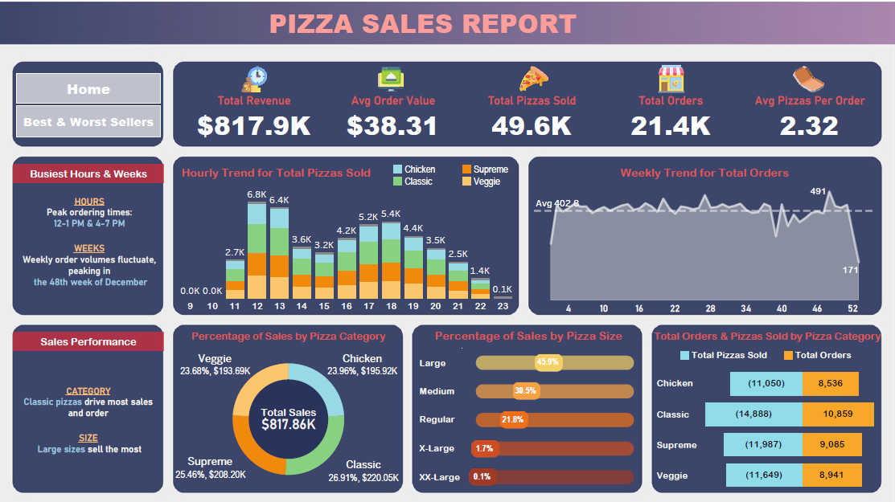
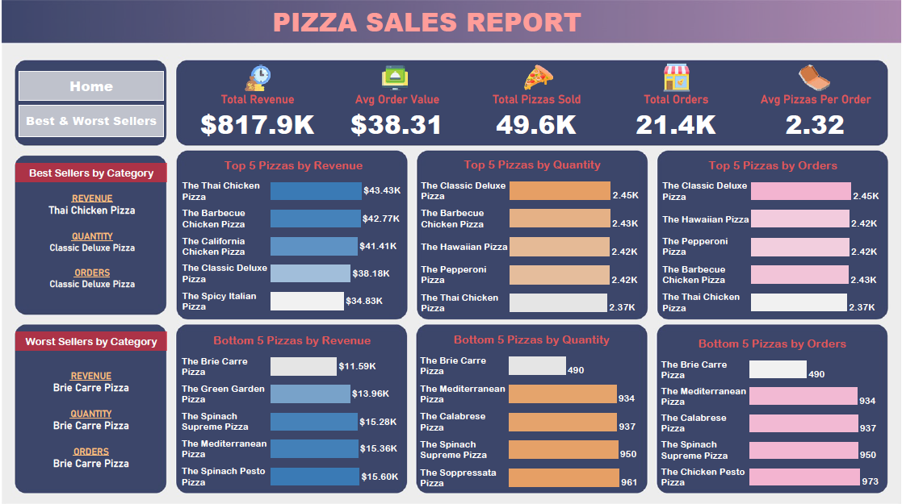

# Pizza Sales Report

### Business Task
Analyzing pizza sales data to understand business performance and customer preferences. This includes calculating key performance indicators like total revenue, average order value, and total pizzas sold. Additionally, it requires creating various charts like bar, line, and pie charts to visualize sales trends, such as hourly and weekly sales patterns, and the popularity of different pizza categories and sizes. The goal is to use these insights for improving business strategies and menu offerings.

### Data Set
- Pizza sales data in 2015 provided by [Swapnjeet S](./pizza_sales.csv)

### Tools
- Microsoft SQL Server 19.3 - View [SQL Scripts](./pizza_sales.sql)
- Tableau for data visualization - View [dashboard](https://public.tableau.com/views/PizzaSalesReport_17065525141110/Home?:display_count=n&:origin=viz_share_link)

### Dashboard

### Attributions
- Special thanks to [Swapnjeet S](https://www.linkedin.com/in/datatutorials/) for his invaluable guidance and insights throughout this project.
- Icons:
  - Total revenue icon: <a href="https://www.flaticon.com/free-icons/deposit" title="deposit icons">Deposit icons created by Freepik - Flaticon</a>
  - Average Order icon: <a href="https://www.flaticon.com/free-icons/online-order" title="online order icons">Online order icons created by Freepik - Flaticon</a>
  - Total Pizzas icon: <a href="https://www.flaticon.com/free-icons/pizza" title="pizza icons">Pizza icons created by Freepik - Flaticon</a>
  - Total Orders icon: <a href="https://www.flaticon.com/free-icons/pizza-shop" title="pizza shop icons">Pizza shop icons created by Aranagraphics - Flaticon</a>
  - Average Pizza icon: <a href="https://www.flaticon.com/free-icons/isometric" title="isometric icons">Isometric icons created by Nsit - Flaticon</a>
